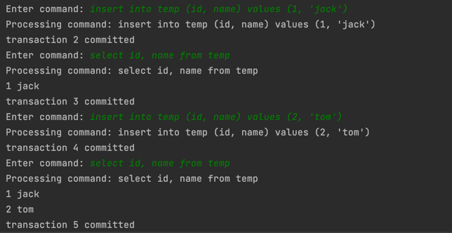

# ProtoDB

ProtoDB is a database system prototype implemented in Java, 
which supports basic CRUD operations. 

I took this project as an opportunity to get deeper insights 
from how database system works internally. This project was 
inspired by and has adopted certain implementations from Prof. Edward Sciore's work - 
[SimpleDB](http://www.cs.bc.edu/~sciore/simpledb/). Additionally, 
some of the internal mechanism refers to PostgreSQL, MySQL and SQLite.

ProtoDB achieves the following functionalities:
- Transaction Management
- Concurrency Management
- Reliability of Database

Todo:
- [ ] Finish implementation of RecoveryMgr
- [ ] Add query optimizer
- [ ] Add documentation

### Demo Showcase:

